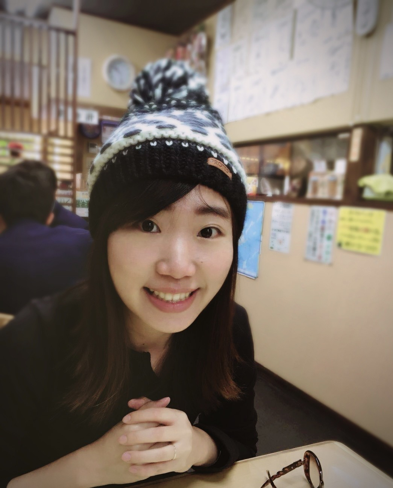

# 劉盈汎 (Vivi Liu)
**後端工程師 | 系統架構設計**

---

<table width="100%">
  <tr>
    <td width="650" valign="top">
      <h2>📝 個人資料</h2>
      <ul>
        <li><strong>性別</strong>：女</li>
        <li><strong>年齡</strong>：35 歲</li>
        <li><strong>就業狀況</strong>：在職中</li>
        <li><strong>聯絡方式</strong>：vivi3172@gmail.com</li>
        <li><strong>Line ID</strong>：vivi0317</li>
        <li><strong>通訊地址</strong>：台北市（大安區）</li>
      </ul>
    </td>
    <td width="280" align="center">
      
    </td>
  </tr>
</table>

---

## 📌 **個人簡介** 
### 擁有 9 年軟體開發經驗，熟悉 C#、.NET 及Vue.js，專注於後端系統架構與開發。具備獨立作業與帶領團隊專案的能力，擅長後端 API 設計與最佳化、資料庫管理與系統整合。具備雲端部署（AWS、Azure）經驗、系統優化與效能調校。擅長跨部門溝通，能夠將業務需求轉化為技術方案。希望加入技術導向的企業，持續精進並與時俱進。
---

## 🎓 **學歷**
- **私立長庚科技大學** – 資訊管理系 三技畢業（2009/9–2011/6）
- **私立南榮技術學院** – 資訊管理科 五專畢業（2004/9–2009/6）

---

## 🛠 **核心技能**
- **程式語言 & 技術**：C#、.NET Core/Framework、Vue.js
- **後端開發**：ASP.NET Web API、MVC、WCF、Dapper、Entity Framework
- **前端開發**：Vue.js、HTML5、CSS、JavaScript、Tailwind CSS
- **資料庫管理**：MSSQL
- **系統架構與開發**：Windows Service、RESTful API 設計
- **雲端與部署**：AWS（EC2、S3、Lambda、DynamoDB）
- **團隊管理與協作**：專案管理、跨部門協作
- **其他**：軟體架構設計、API 整合、系統效能優化

---

## 💼 **工作經驗**

### **商之器股份有限公司**（2015/8 – 現在）
**資深應用研發工程師**
- 帶領團隊進行醫療軟體開發，負責架構設計
- 與客戶討論需求，轉化為技術方案並落實開發
- 後端開發，資料庫規劃設計

### **商之器股份有限公司**（2011/5 – 2015/3）
**客服部秘書 & 董事長秘書**
- 負責硬體與軟體採購、訂單處理、表單製作
- 協助主管交辦事項，兼任董事長秘書

---

## 💼 **實習經驗**

### **台塑石化股份有限公司**（2010/11 – 2011/5）
**實習生**（500人以上企業）
- 資料處理（建檔、歸檔）、送文件、工時統計、主管交辦事項

### **鈞鎂（印刷電路板製造業(PCB)）**（2010/7 – 2010/8）
**ISO / 產品品質管理實習生**（1~30人企業）
- 參與會議學習 PM 工作

---

## 📜 **專業證照 & 認證**
- AWS Certified Solutions Architect - Associate
- Microsoft Certified: Azure Developer Associate 
- Microsoft Certified: Security, Compliance, and Identity Fundamentals
- Microsoft Certified: Azure Fundamentals

---

## 🎯 **求職目標**
希望加入技術導向的企業，專注於**雲端架構、微服務、AI 應用開發或高效能系統設計**，挑戰新的技術，持續學習與成長。

